# 🔄 Frontend Flows - Mermaid Diagrams

Biểu đồ trình tự (sequence diagrams) cho các luồng chính trong frontend.

---

## 1. User Authentication Flow

### **Registration Flow**

```mermaid
sequenceDiagram
    participant User as 👤 User
    participant Browser as 🌐 Browser
    participant Frontend as ⚛️ Frontend
    participant Backend as 🔧 Backend

    User->>Browser: Truy cập #register
    Browser->>Frontend: Load RegisterPage
    Frontend->>Browser: Hiển thị form (email, password, confirmPassword)
    
    User->>Browser: Nhập thông tin & click "Đăng ký"
    Browser->>Frontend: handleRegister()
    Frontend->>Frontend: Validate form inputs
    
    Frontend->>Backend: POST /auth/register
    Backend->>Backend: Kiểm tra email tồn tại
    Backend->>Backend: Hash password
    Backend->>Backend: Tạo user mới
    Backend->>Frontend: { id, email, name }
    
    Frontend->>Frontend: Tự động login
    Frontend->>Backend: POST /auth/login
    Backend->>Frontend: { user, token }
    
    Frontend->>Browser: Lưu token + user vào localStorage
    Frontend->>Browser: Redirect #dashboard
    Browser->>User: ✅ Hiển thị dashboard
```

---

### **Login Flow**

```mermaid
sequenceDiagram
    participant User as 👤 User
    participant Browser as 🌐 Browser
    participant Frontend as ⚛️ Frontend
    participant Backend as 🔧 Backend
    participant Storage as 💾 localStorage

    User->>Browser: Truy cập #login
    Browser->>Frontend: Load LoginPage
    Frontend->>Browser: Hiển thị form (email, password)
    
    User->>Browser: Nhập credentials & click "Đăng nhập"
    Browser->>Frontend: handleLogin()
    Frontend->>Frontend: Validate inputs
    
    Frontend->>Backend: POST /auth/login
    Backend->>Backend: Tìm user bằng email
    Backend->>Backend: Kiểm tra password
    Backend->>Backend: Tạo JWT token
    Backend->>Frontend: { user: {...}, token: "eyJ..." }
    
    Frontend->>Storage: localStorage.setItem('auth', {token, user})
    Frontend->>Browser: Check user.role
    alt User Role = 'admin'
        Frontend->>Browser: Redirect #admin
    else User Role = 'customer'
        Frontend->>Browser: Redirect #home
    end
    
    Browser->>User: ✅ Logged in successfully
```

---

## 2. Shopping & Cart Flow

### **Product to Cart Flow**

```mermaid
sequenceDiagram
    participant User as 👤 User
    participant Frontend as ⚛️ Frontend
    participant Backend as 🔧 Backend
    participant Storage as 💾 Cart (localStorage)

    User->>Frontend: Browse products (Home, #blanks)
    Frontend->>Backend: GET /products (or /products/blanks)
    Backend->>Frontend: { products: [...] }
    Frontend->>Frontend: Display products grid
    
    User->>Frontend: Click product
    Frontend->>Backend: GET /products/{id}
    Backend->>Frontend: { product details, variants }
    Frontend->>Frontend: Display BlankDetailPage
    
    User->>Frontend: Select color, size, quantity
    Frontend->>Frontend: Update selectedColor, selectedSize, quantity
    
    User->>Frontend: Click "Add to Cart"
    Frontend->>Backend: POST /cart/add<br/>{ productId, quantity, colorCode, sizeCode }
    Backend->>Backend: Validate stock
    Backend->>Backend: Create cart item
    Backend->>Frontend: { cartItem }
    
    Frontend->>Frontend: Show success message
    Frontend->>Storage: Update cart state
    Frontend->>User: ✅ Item added to cart
```

---

### **Cart Management Flow**

```mermaid
sequenceDiagram
    participant User as 👤 User
    participant Frontend as ⚛️ Frontend
    participant Backend as 🔧 Backend

    User->>Frontend: Navigate to #cart
    Frontend->>Backend: GET /cart
    Backend->>Frontend: { items: [...], total: 123 }
    Frontend->>Frontend: Display ShoppingCartPage
    
    alt Update Quantity
        User->>Frontend: Change qty for item
        Frontend->>Backend: PATCH /cart/items/{id}<br/>{ quantity: 3 }
        Backend->>Frontend: { updated item }
        Frontend->>Frontend: Recalculate totals
    end
    
    alt Remove Item
        User->>Frontend: Click delete on item
        Frontend->>Backend: DELETE /cart/items/{id}
        Backend->>Frontend: { success }
        Frontend->>Backend: GET /cart (reload)
        Backend->>Frontend: { items: [...] }
    end
    
    alt Apply Voucher
        User->>Frontend: Enter voucher code
        Frontend->>Frontend: POST /cart/apply-voucher<br/>{ voucherCode: "SAVE10" }
        Backend->>Backend: Validate voucher
        Backend->>Backend: Calculate discount
        Backend->>Frontend: { code, discount, discountAmount }
        Frontend->>Frontend: Update cart with discount
        Frontend->>Frontend: localStorage.setItem('appliedVoucher', {...})
    end
    
    User->>Frontend: Click "Proceed to Checkout"
    Frontend->>Frontend: Navigate to #checkout
    Frontend->>User: ✅ Go to checkout
```

---

## 3. Design Customization Flow

### **Customizer Full Flow**

```mermaid
sequenceDiagram
    participant User as 👤 User
    participant Frontend as ⚛️ Frontend
    participant Backend as 🔧 Backend
    participant Canvas as 🎨 Canvas

    User->>Frontend: Go to #customizer
    Frontend->>Backend: GET /products/{id}
    Backend->>Frontend: { product, variants, colors }
    Frontend->>Backend: GET /customizer/saved
    Backend->>Frontend: { savedDesigns: [...] }
    Frontend->>Frontend: Display CustomizerPage
    
    User->>Canvas: Drag & drop canvas element
    Canvas->>Frontend: Add text/image/design to canvas
    Frontend->>Frontend: Add to canvasElements[]
    
    User->>Canvas: Modify element (position, size, color, etc.)
    Canvas->>Frontend: Update element properties
    Frontend->>Frontend: Update canvasElements[]
    
    alt Calculate Price (Real-time)
        Frontend->>Frontend: User selects color/size
        Frontend->>Frontend: Debounce 500ms
        Frontend->>Backend: POST /customizer/calculate-price<br/>{ productId, colorCode, sizeCode, quantity, canvasData }
        Backend->>Backend: Get base product price
        Backend->>Backend: Calculate customization fee
        Backend->>Backend: totalPrice = basePrice + fee
        Backend->>Frontend: { basePrice, customizationFee, totalPrice }
        Frontend->>Frontend: Display calculated price
    end
    
    alt Save Design
        User->>Frontend: Click "Save Design"
        Frontend->>Backend: POST /customizer/save<br/>{ productId, name, canvasData }
        Backend->>Backend: Save design to database
        Backend->>Frontend: { designId }
        Frontend->>Frontend: Show success
    end
    
    alt Load Saved Design
        User->>Frontend: Click saved design
        Frontend->>Backend: GET /customizer/saved/{id}
        Backend->>Frontend: { designId, canvasData }
        Frontend->>Canvas: Restore canvas elements
        Canvas->>Frontend: Load previous design
    end
    
    User->>Frontend: Click "Add to Cart"
    Frontend->>Backend: POST /cart/add<br/>{ productId, quantity, customDesignData }
    Backend->>Frontend: { cartItemId }
    Frontend->>Frontend: Navigate to #cart
    Frontend->>User: ✅ Added customized product to cart
```

---

## 4. Checkout & Payment Flow

### **Multi-Step Checkout Flow**

```mermaid
sequenceDiagram
    participant User as 👤 User
    participant Frontend as ⚛️ Frontend
    participant Backend as 🔧 Backend
    participant VNPay as 💳 VNPay Gateway

    User->>Frontend: Navigate to #checkout
    Frontend->>Backend: GET /cart
    Backend->>Frontend: { items, total }
    Frontend->>Backend: GET /addresses
    Backend->>Frontend: { addresses: [...] }
    Frontend->>Frontend: Display CheckoutPage - Step 1
    
    alt Step 1: Select Address
        User->>Frontend: Select address from list
        Frontend->>Frontend: setSelectedAddress(address)
        alt No address or want new
            User->>Frontend: Click "Add New Address"
            Frontend->>Frontend: Show address form dialog
            User->>Frontend: Fill form & submit
            Frontend->>Backend: POST /api/addresses<br/>{ label, line1, line2, state, country, zip }
            Backend->>Frontend: { addressId }
            Frontend->>Backend: GET /addresses (reload list)
        end
        User->>Frontend: Click "Next"
        Frontend->>Frontend: setCurrentStep(2)
    end
    
    alt Step 2: Select Shipping Method
        Frontend->>Frontend: Display shipping options
        Frontend->>Frontend: (Standard: 3-5 days, Express: 1-2 days)
        User->>Frontend: Select shipping method
        Frontend->>Frontend: setShippingMethod()
        Frontend->>Frontend: Calculate shipping fee
        User->>Frontend: Click "Next"
        Frontend->>Frontend: setCurrentStep(3)
    end
    
    alt Step 3: Payment
        Frontend->>Frontend: Display payment summary
        Frontend->>Frontend: Show: Items, Subtotal, Shipping, Discount, Tax, Total
        User->>Frontend: Select payment method (VNPay)
        Frontend->>Frontend: setPaymentMethod('vnpay')
        User->>Frontend: Optional: Use green points
        Frontend->>Frontend: setUseGreenPoints(true)
        
        User->>Frontend: Click "Confirm Order"
        Frontend->>Backend: POST /orders<br/>{ items, addressId, shippingMethod, paymentMethodId, voucherCode, useGreenPoints }
        Backend->>Backend: Create order
        Backend->>Backend: Generate payment URL
        Backend->>Frontend: { orderId, paymentUrl }
        
        Frontend->>VNPay: Redirect to VNPay gateway
        VNPay->>User: Show payment form
        User->>VNPay: Enter card info & confirm
        VNPay->>VNPay: Process payment
        
        alt Payment Success
            VNPay->>Frontend: Redirect #payment-callback?vnp_ResponseCode=00&...
            Frontend->>Frontend: [PaymentCallbackPage]
            Frontend->>Frontend: Extract URL params
            Frontend->>Frontend: Verify transaction
            Frontend->>Frontend: Update order status to "processing"
            Frontend->>Frontend: Redirect #order-success?orderId=xxx
            Frontend->>Backend: GET /orders/{orderId}
            Backend->>Frontend: { order details }
            Frontend->>Frontend: Display OrderSuccessPage
            Frontend->>User: ✅ Order created successfully!
        else Payment Cancelled
            VNPay->>Frontend: Redirect #payment-cancel
            Frontend->>Frontend: [PaymentCancelPage]
            Frontend->>Frontend: Show cancel message
            Frontend->>Frontend: Option to try again
        end
    end
```

---

## 5. Order Tracking Flow

### **Order to Tracking Flow**

```mermaid
sequenceDiagram
    participant User as 👤 User
    participant Frontend as ⚛️ Frontend
    participant Backend as 🔧 Backend

    User->>Frontend: Navigate to #dashboard
    Frontend->>Backend: GET /users/dashboard/recent-orders
    Backend->>Frontend: { orders: [...] }
    Frontend->>Frontend: Display recent orders
    
    User->>Frontend: Click "View All Orders"
    Frontend->>Frontend: Navigate to #orders
    Frontend->>Backend: GET /orders/my-orders
    Backend->>Frontend: { orders: [...] }
    Frontend->>Frontend: Display OrdersListPage
    
    User->>Frontend: Click on order
    Frontend->>Frontend: Navigate to #order-detail?id=orderId
    Frontend->>Backend: GET /orders/{orderId}
    Backend->>Frontend: { order details, items, address, timeline }
    Frontend->>Frontend: Display OrderDetailPage
    
    User->>Frontend: Click "Track Shipment"
    Frontend->>Frontend: Navigate to #order-tracking?id=orderId
    Frontend->>Backend: GET /shipments/order/{orderId}
    Backend->>Frontend: { shipmentId, trackingNumber, status, events: [...] }
    Frontend->>Frontend: Display OrderTrackingPage
    Frontend->>Frontend: Render timeline:
    Frontend->>Frontend: - Picked up (timestamp, location)
    Frontend->>Frontend: - In transit (timestamp, location)
    Frontend->>Frontend: - Out for delivery (timestamp, location)
    Frontend->>Frontend: - Delivered (timestamp, location)
    
    User->>Frontend: Xem vị trí real-time
    Frontend->>User: ✅ Display tracking information
```

---

## 6. User Profile Management Flow

### **Dashboard & Settings Flow**

```mermaid
sequenceDiagram
    participant User as 👤 User
    participant Frontend as ⚛️ Frontend
    participant Backend as 🔧 Backend

    User->>Frontend: Navigate to #dashboard
    Frontend->>Backend: GET /users/dashboard/stats
    Backend->>Frontend: { totalOrders, totalSpent, loyaltyPoints, treesPlanted }
    Frontend->>Backend: GET /users/dashboard/recent-orders
    Backend->>Frontend: { orders: [...] }
    Frontend->>Frontend: Display UserDashboardPage with tabs
    
    alt Tab: Addresses
        Frontend->>Frontend: Show Addresses tab
        Frontend->>Backend: GET /addresses
        Backend->>Frontend: { addresses: [...] }
        Frontend->>Frontend: Display AddressesPage
        
        alt Add Address
            User->>Frontend: Click "Add Address"
            Frontend->>Frontend: Show form dialog
            User->>Frontend: Fill & submit
            Frontend->>Backend: POST /addresses
            Backend->>Frontend: { addressId }
        end
        
        alt Edit Address
            User->>Frontend: Click edit icon
            Frontend->>Frontend: Show form with data
            User->>Frontend: Update & submit
            Frontend->>Backend: PATCH /addresses/{id}
            Backend->>Frontend: { updated address }
        end
        
        alt Set Default
            User->>Frontend: Click "Set as Default"
            Frontend->>Backend: PATCH /addresses/{id}/set-default
            Backend->>Frontend: { is_default: true }
        end
    end
    
    alt Tab: Rewards
        Frontend->>Frontend: Show Rewards tab
        Frontend->>Backend: GET /rewards/points
        Backend->>Frontend: { balance, tier, nextTierPoints }
        Frontend->>Backend: GET /rewards/history
        Backend->>Frontend: { history: [...] }
        Frontend->>Backend: GET /rewards/catalog
        Backend->>Frontend: { catalog: [...] }
        Frontend->>Frontend: Display RewardsPage with tabs
        
        alt Redeem Reward
            User->>Frontend: Click reward in catalog
            Frontend->>Frontend: Show redeem dialog
            User->>Frontend: Confirm redeem
            Frontend->>Backend: POST /rewards/redeem/{rewardId}
            Backend->>Backend: Check balance >= requiredPoints
            Backend->>Backend: Deduct points
            Backend->>Backend: Mark reward as redeemed
            Backend->>Frontend: { redeemId, status }
            Frontend->>Frontend: Show success
        end
    end
    
    alt Tab: Vouchers
        Frontend->>Frontend: Show Vouchers tab
        Frontend->>Backend: GET /vouchers/my-vouchers
        Backend->>Frontend: { vouchers: [...] }
        Frontend->>Frontend: Display VouchersPage
        
        alt Validate Voucher
            User->>Frontend: Enter voucher code
            Frontend->>Backend: GET /vouchers/validate?code=xxx&orderAmount=xxx
            Backend->>Backend: Check voucher exists
            Backend->>Backend: Check expiry date
            Backend->>Backend: Calculate discount
            Backend->>Frontend: { valid, code, discount, discountAmount }
            Frontend->>Frontend: Show validation result
        end
    end
    
    alt Tab: Settings (Change Password)
        Frontend->>Frontend: Show Settings tab
        User->>Frontend: Enter current & new password
        Frontend->>Backend: POST /auth/change-password<br/>{ currentPassword, newPassword, confirmPassword }
        Backend->>Backend: Verify current password
        Backend->>Backend: Hash new password
        Backend->>Backend: Update user password
        Backend->>Frontend: { success }
        Frontend->>Frontend: Show success & clear form
    end
    
    Frontend->>User: ✅ All settings updated
```

---

## 7. Design Gallery & Favorites Flow

### **Design Discovery Flow**

```mermaid
sequenceDiagram
    participant User as 👤 User
    participant Frontend as ⚨️ Frontend
    participant Backend as 🔧 Backend

    User->>Frontend: Navigate to #designs
    Frontend->>Backend: GET /designs?page=1&limit=12
    Backend->>Frontend: { designs: [...], total: 500 }
    Frontend->>Backend: GET /designs/trending?limit=10
    Backend->>Frontend: { trendingDesigns: [...] }
    Frontend->>Frontend: Display DesignGalleryPage
    Frontend->>Frontend: Apply filters & sort on frontend
    
    alt Search
        User->>Frontend: Type search query
        Frontend->>Frontend: Filter designs locally
    end
    
    alt Filter
        User->>Frontend: Select filters (category, tags, eco-friendly)
        Frontend->>Frontend: Filter designs locally
    end
    
    alt Sort
        User->>Frontend: Select sort (trending, newest, likes)
        Frontend->>Frontend: Sort designs locally
    end
    
    alt Like Design (Add to Favorites)
        User->>Frontend: Click heart icon
        Frontend->>Backend: POST /favorites<br/>{ designId }
        Backend->>Backend: Create favorite record
        Backend->>Frontend: { favoriteId }
        Frontend->>Frontend: Update likedDesigns[]
    end
    
    alt View Design Detail
        User->>Frontend: Click design
        Frontend->>Frontend: Navigate to #design-detail?id=designId
        Frontend->>Backend: GET /designs/{id}
        Backend->>Frontend: { design details, artist, stats }
        Frontend->>Frontend: Display DesignDetailPage
        
        alt Add to Cart (Apply to Product)
            User->>Frontend: Click "Add to Cart"
            Frontend->>Frontend: Navigate to #customizer
            Frontend->>Backend: GET /products/{selectedProductId}
            Backend->>Frontend: { product }
            Frontend->>Frontend: Pre-load design on canvas
        end
    end
    
    alt View All Favorites
        User->>Frontend: Navigate to #favorites
        Frontend->>Backend: GET /favorites
        Backend->>Frontend: { favorites: [...] }
        Frontend->>Frontend: Display FavoritesPage
        
        alt Remove Favorite
            User->>Frontend: Click remove icon
            Frontend->>Backend: DELETE /favorites/{favoriteId}
            Backend->>Frontend: { success }
            Frontend->>Frontend: Update favorites list
        end
    end
    
    Frontend->>User: ✅ Design management complete
```

---

## 8. Reviews Flow

### **Review Management Flow**

```mermaid
sequenceDiagram
    participant User as 👤 User
    participant Frontend as ⚛️ Frontend
    participant Backend as 🔧 Backend

    User->>Frontend: Navigate to #reviews
    Frontend->>Backend: GET /reviews/my-reviews
    Backend->>Frontend: { reviews: [...] }
    Frontend->>Frontend: Display ReviewsPage
    
    alt View My Reviews
        Frontend->>Frontend: Display reviews in list
        Frontend->>Frontend: Show: Product, rating (stars), title, comment, date
    end
    
    alt Edit Review
        User->>Frontend: Click edit icon
        Frontend->>Frontend: Show edit dialog with current review
        User->>Frontend: Update review & submit
        Frontend->>Backend: PATCH /reviews/{id}<br/>{ rating, title, comment }
        Backend->>Backend: Update review record
        Backend->>Frontend: { updated review }
        Frontend->>Frontend: Update reviews list
    end
    
    alt Delete Review
        User->>Frontend: Click delete icon
        Frontend->>Frontend: Show confirmation dialog
        User->>Frontend: Confirm delete
        Frontend->>Backend: DELETE /reviews/{id}
        Backend->>Backend: Delete review record
        Backend->>Frontend: { success }
        Frontend->>Frontend: Remove from list
    end
    
    alt Write New Review (from OrderDetailPage)
        User->>Frontend: Navigate to #order-detail?id=orderId
        Frontend->>Backend: GET /orders/{id}
        Backend->>Frontend: { order with items }
        Frontend->>Frontend: Display OrderDetailPage
        
        User->>Frontend: Click "Write Review" on product
        Frontend->>Frontend: Show review form dialog
        User->>Frontend: Select rating, enter title & comment
        Frontend->>Backend: POST /reviews<br/>{ productId, rating, title, comment }
        Backend->>Backend: Create review record
        Backend->>Backend: Update product rating stats
        Backend->>Frontend: { reviewId }
        Frontend->>Frontend: Show success
    end
    
    Frontend->>User: ✅ Review management complete
```

---

## Summary of All Flows

```mermaid
graph TD
    A["👤 User"] -->|Register/Login| B["🔓 Auth Flow"]
    B -->|Success| C["🏠 Home Page"]
    
    C -->|Browse Products| D["🛍️ Shopping Flow"]
    D -->|Select Product| E["🛒 Cart Flow"]
    E -->|Proceed| F["💳 Checkout Flow"]
    F -->|Verify Payment| G["✅ Payment Callback"]
    G -->|Success| H["📦 Order Success"]
    
    C -->|Browse Designs| I["🎨 Design Gallery"]
    I -->|Customize| J["🖌️ Customizer Flow"]
    J -->|Save Design| K["💾 Saved Designs"]
    J -->|Add to Cart| E
    
    H -->|View Orders| L["📋 User Dashboard"]
    L -->|Manage Orders| M["📊 Order Tracking Flow"]
    M -->|View Tracking| N["🗺️ Real-time Tracking"]
    
    L -->|Manage Profile| O["👤 Profile Management"]
    O -->|Manage Addresses| P["📍 Addresses"]
    O -->|Manage Rewards| Q["🎁 Rewards"]
    O -->|Manage Vouchers| R["🎟️ Vouchers"]
    O -->|Manage Reviews| S["⭐ Reviews"]
    O -->|Manage Favorites| T["❤️ Favorites"]
```

---

**Last Updated:** December 24, 2024

